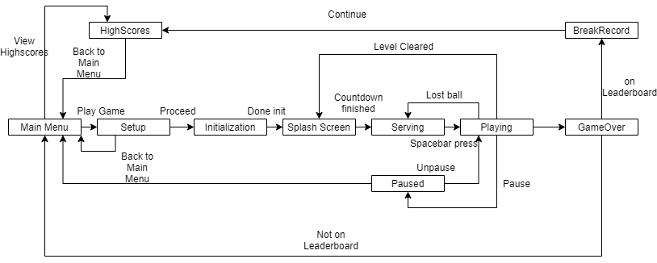

# Break0ut 

A breakout / arkanoid clone made in pygame, by AdmiJW

---

 

## Usage:

Download the game in __`dist.rar`__. Extract and run `main.exe`. Give it some time to load, and enjoy!
Most of the controls are done using __WASD__ or __Arrow Keys__. Selection by using __Spacebar__ or __Enter/Return__ key.

---

 

## Features:

* 5 powerups:
    * Longer Paddle
    * Stronger Ball
    * Into the future - Allows you to see the projectory of the ball ahead of time
    * Recover Health
    * Double ball - Introduces a second ball into the game

---

 

## State Machine

---

 

## Implementation Notes

* Design patterns used include:
    * Singleton - CONFIG, CONSTANT, Audio etc
    * Strategy - Powerups apply different strategy to render() and update() in Playing state
    * State - Game is state machine. Avoid if else as much as possible
    * Null Object - NullBall to avoid null checking on balls
    * Decorator - render() has decorators applied to draw fps, heart and score, and powerup timeleft
* At one point, the game had memory leaks where RAM usage increases as the player progresses the level. The reason was due to dangling reference to Playing state when implementing Strategy pattern via `types.Methodtype()`. This causes the garbage collector to unable to free the memory of the `Playing` state. Problem is fixed once I changed the implementation of Strategy pattern. *Lesson: Be careful when implementing strategy via `types.MethodType()` or `__get__` magic method. It may end up in cyclic reference if you are not careful.*

 

### Other:

* Tile graphics retrieved from [OpenGameArt](https://opengameart.org/content/breakout-set)

* Background generated via [Magic Pattern](https://www.magicpattern.design/tools/css-backgrounds)

* Music and sound effects are created by myself.